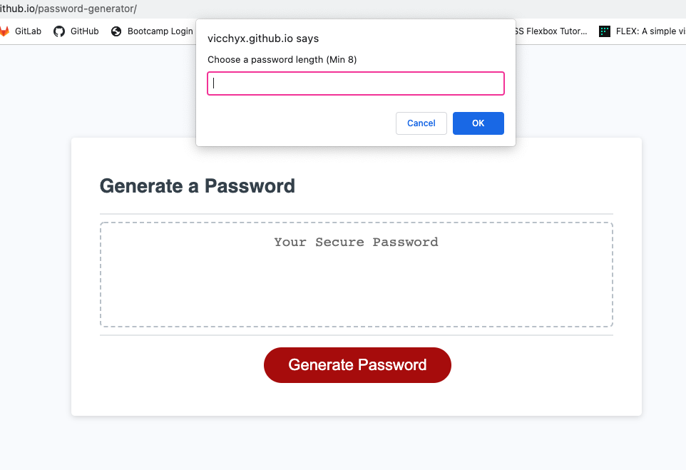
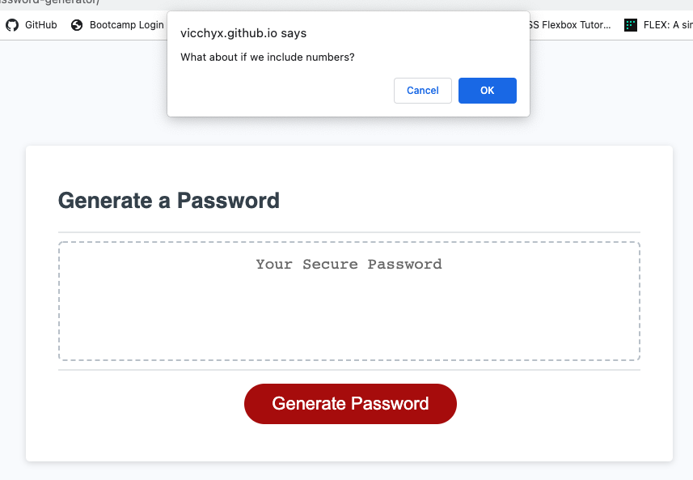
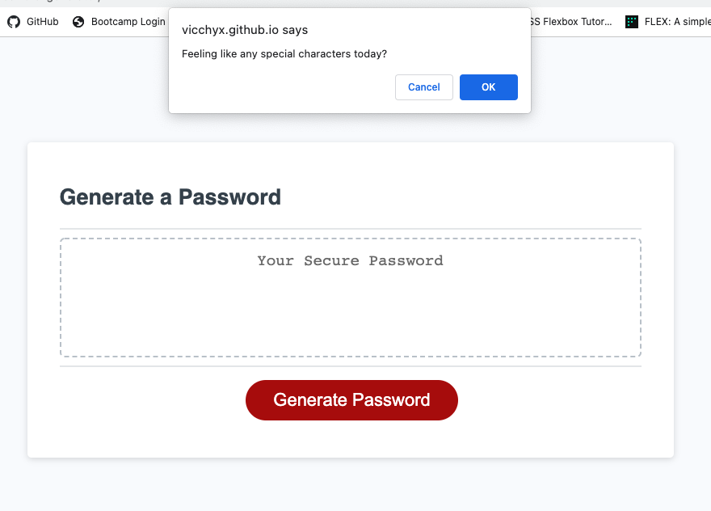

##HOMEWORK3 - Password Generator: JavaScript
-----------------------------------
This project it is a Password Generator website that uses JavaScript commands to generate a random password. The code is meant to create a password using special characters, lower and upper case letters & numbers.

It contains: 
- Prompt for uppercase letters
- Prompt for lowercase letters
- Prompt for numbers
- Prompt for special characters
- "Generate Password" button

Link to deployed application: https://vicchyx.github.io/password-generator/

Screenshots of project:

